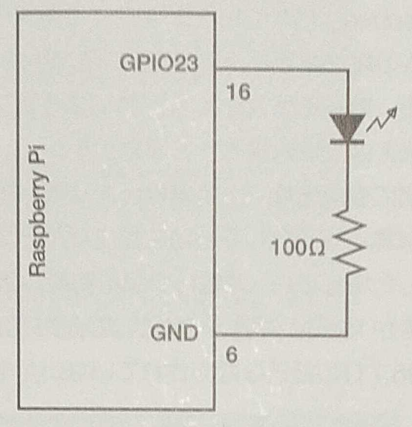
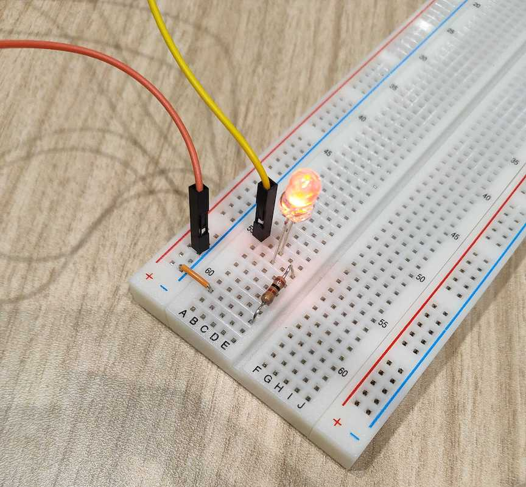
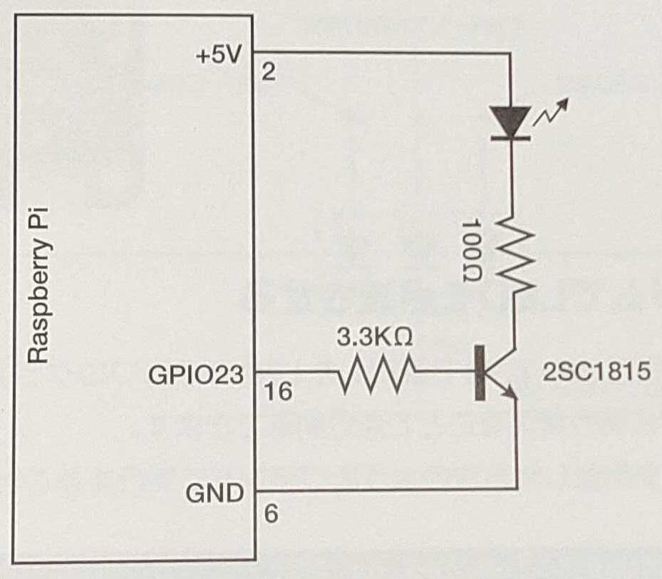
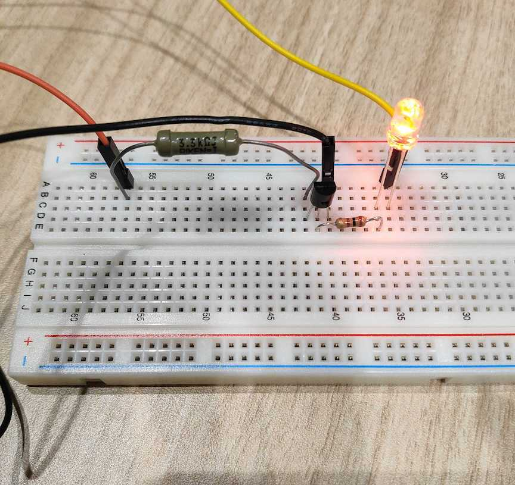
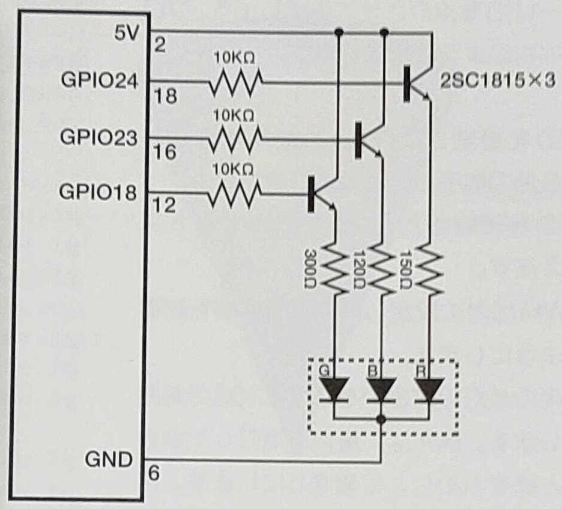
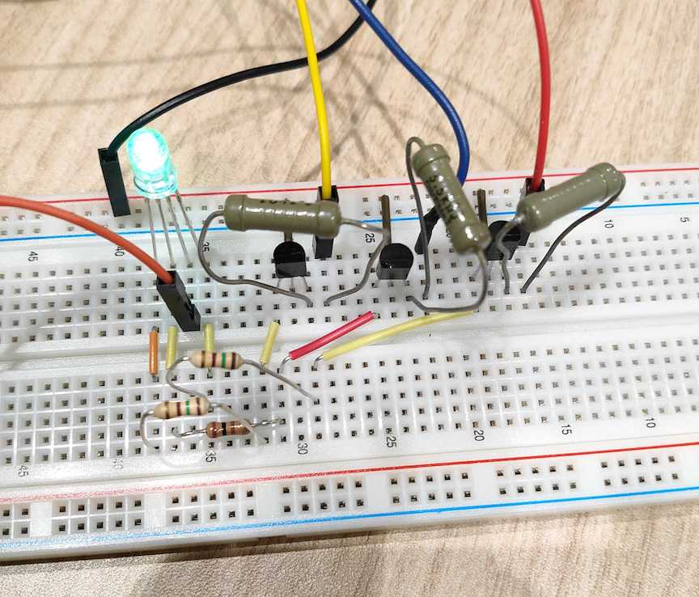

# 2020/12/26(土)

## ブレッドボード

|  |
|:-:|
| ブレッドボードの内部接続 |

## GPIO

### 概要

参考: [*GPIO - Raspberry Pi Documentation*](https://www.raspberrypi.org/documentation/usage/gpio/)

Raspberry Piには、GPIO(general-purpose input/output)が備わっている。

それぞれのGPIOピンは、ソフトウェア的に、入力または出力として指定することができる。

制御には例えば[`gpiozero`](https://gpiozero.readthedocs.io/en/stable/)ライブラリを用いる。

5Vピン、3.3Vピン、GND(0Vピン)は制御不可能である。残りの全てのピンは、3.3Vピン——3.3V出力に設定でき、或いは3.3Vの入力に耐えられる——となっている。

出力として指定されたGPIOピンは、3.3Vまたは0Vで切り替えられる。

それ以外の電圧を出力したい場合には、PWM(pulse-width modulation)を用いる。これは、電圧のオンオフを高速で切り替えることで、その中間の電圧を擬似的に再現する。ソフトウェアPWMは、全てのGPIOピンにおいてサポートされている。

入力として指定されたGPIOピンは、3.3Vまたは0Vの入力として読むことができる。

### 端子番号

下の図のほか、`pinout`コマンドによっても確認できる。

|  |
|:-:|
| GPIO端子番号 |

<a id='led_switching'></a>
### Lチカ

|  |  |
|:-:|:-:|
| 回路図 | 実際の接続 |

```python
# 1.py
# 結果: LEDが付いたり消えたりする

import time

import gpiozero as gz

output_pin:   int = 23
interval_sec: int = 1

led: gz.LED = gz.LED(output_pin)

while (True):
    print('ON')
    led.on()
    time.sleep(interval_sec)
    print('OFF')
    led.off()
    time.sleep(interval_sec)
```

### PWMによるLEDの明るさ調整

回路は同上。

```python
# 2.py
# 結果: LEDが徐々に明るくなり、今度は徐々に暗くなり、を繰り返す

import time

import gpiozero as gz

output_pin:       int   = 23
interval_sec:     int   = 1
delta_brightness: float = 0.01
wait_sec:         float = 0.5

led: gz.LED = gz.PWMLED(output_pin)

brightness: float = led.value
should_add_brightness: bool = True

while (True):

    if (should_add_brightness):
        brightness += delta_brightness
    else:
        brightness -= delta_brightness

    if (brightness > 1):
        should_add_brightness = False
        brightness = 1
        time.sleep(wait_sec)
    elif (brightness < 0):
        should_add_brightness = True
        brightness = 0
        time.sleep(wait_sec)

    led.value = brightness

    time.sleep(interval_sec * delta_brightness)
```

### トランジスタの利用

トランジスタをスイッチとして利用し、その出力をソフトウェア的に制御する。[Lチカ](#led_switching)と似ているが、3.3Vよりも大きな電圧を掛けられる。

プログラムは[Lチカ](#led_switching)の場合と全く同じである。

|  |  |
|:-:|:-:|
| 回路図 | 実際の接続 |

### Lチカ (フルカラーLED)

|  |  |
|:-:|:-:|
| 回路図 | 実際の接続 |

```python
# 3.py
# 結果: r,g,b,r+g,r+b,g+b,r+g+bの順に点灯するのを繰り返す

import time

import gpiozero as gz

output_pin: dict = {
    'red':   24,
    'green': 18,
    'blue':  23,
}
interval_sec:    int  = 1

led_red:   gz.LED = gz.LED(output_pin['red'])
led_green: gz.LED = gz.LED(output_pin['green'])
led_blue:  gz.LED = gz.LED(output_pin['blue'])

def led_toggle(led_list: list) -> None:
    if (type(led_list) != list):
        led_list = [led_list]
    for led in led_list:
        led.toggle()

def led_blink(*args, **kwargs) -> None:
    for i in range(2):
        led_toggle(*args, **kwargs)
        time.sleep(interval_sec)

while (True):

    print('r')
    led_blink(led_red)

    print('g')
    led_blink(led_green)

    print('b')
    led_blink(led_blue)

    print('rg')
    led_blink([led_red, led_green])

    print('rb')
    led_blink([led_red, led_blue])

    print('gb')
    led_blink([led_green, led_blue])

    print('rgb')
    led_blink([led_red, led_green, led_blue])
```

